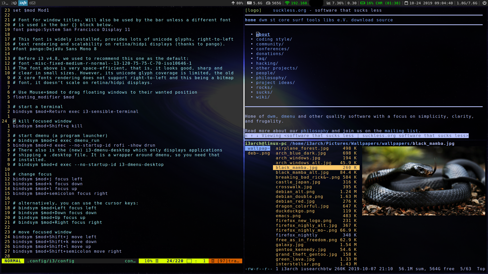

I am a simple 18 year old guy deeply interested in programming, unix, open-source and STEM in general. During my learning process, I have been in so many rabbitholes that I thought of doing a 3-part series of blog posts on this very topic. In this first part of the series, I am going to explain a rabbithole that I fell into a while back in very subtle way and it changed my workflow and knowledge about operating systems so much that I don't think I'll ever be will be able to go back to where I was before.

After I switched entirely to Linux last year, I decided to learn C++ by following a Stroustrup's book on C++. As a Sublime Text / Atom guy, I decided to do the exercises in Vim to brush up on my Vim skills.

I found myself constantly switching between Vim, terminal, e-book viewer and my browser windows in order to solve the problems. As an Ubuntu Gnome normie, I was using the `alt + tab` key combination to do so. Eventually, I realized I could do the same thing using `super + tab` keys! It was surprising to me because I had always used the former solution since Windows. To see which was more common among other linux users, I did a quick search on the web.

I found a reddit thread where someone had asked the same question that I had- which of the solutions was more common. The first comment on the thread said, "`alt + tab` because I didn't know `super` could do that as well." Okay. But what was the beginning of the biggest distraction of my life ever, was the second comment with literally 7 upvotes. It said, "Neither, because I use i3wm. :)"

Now, as a voraciuosly curious person, I _had_ to do a quick search- I had never heard of i3wm before. As some of you might already know, it's a powerful and popular tiling window manager. One look into its documentation, I knew I always needed something like this in order to do things effectively.

I found out that I looks pretty damn ugly out of the box. Not just it's look, but I had to do a number of additions and modifications to its 'config' file(aka its dotfile) to make things work properly.

For example, it isn't very straightforward to set a wallpaper. You have to install and configure a separate little program called '[feh](https://wiki.archlinux.org/index.php/Feh)' in order to do so (mind you, there are [alternatives](https://wiki.archlinux.org/index.php/Nitrogen)). It took me 3 weeks to make it usable for my needs (i3-gaps, i3blocks, touchpad configuration, audio controls, fonts, colors, keybindings, etc) and during that period, I came across the Arch Linux Wiki (archwiki), and that was it, I was well onto the path to becoming a giant terminal junkie and a [ricer](https://www.reddit.com/r/unixporn/wiki/themeing/dictionary#wiki_rice).

It was only a matter of days that I came across [r/unixporn](https://reddit.com/r/unixporn), [Luke Smith](https://www.youtube.com/channel/UC2eYFnH61tmytImy1mTYvhA), [DistroTube](https://www.youtube.com/channel/UCVls1GmFKf6WlTraIb_IaJg), etc. The end result? Now my computer looks like [this](https://github.com/rsapkf/dotfiles) and I have an entire [repository](https://github.com/rsapkf/dotfiles) on Github to backup and store my dotfiles in case I want to change my distro. I became another 'btw, I use Arch' guy, I'm constantly configuring my system to fit my needs, and my bookmarks have begun to rise in number exponentially. I discover and use new tools and open source software programs all the time AND I haven't yet gone back to the PPP Using C++ book. I think It'll be another month or so before I resume it but there is no denying that that stupid question has taught me so much.

---

##### Learn more:

If you're interested in these things as well, I suggest you to look into window managers first. Because of the excellent documentation that it has, my personal suggestion is to go for [i3](https://i3wm.org) first. If you don't mind having to patch your window manager everytime you want it to do something, go for [dwm](https://dwm.suckless.org). If you are a Haskell fan, try [Xmonad](https://github.com/xmonad/xmonad). [There](https://github.com/Airblader/i3) [are](https://github.com/baskerville/bspwm) [several](http://www.qtile.org/) [options](https://awesomewm.org/) [to](http://www.herbstluftwm.org/) [choose](http://openbox.org/) [from](https://www.youtube.com/playlist?list=PL5--8gKSku17lbSBHPduj4qG97qxJe0UM). You will learn many other things while you configure your system for your needs. If you need a quick guide to comparison between features of different window managers, check out [this](https://wiki.archlinux.org/index.php/Window_manager#List_of_window_managers) ArchWiki page or [this video](https://www.youtube.com/watch?v=Obzf9ppODJU) from DistroTube. Once you get the hang of how dotfiles work, look at mine on my [GitHub](https://github.com/rsapkf/dotfiles) or check out the [unofficial guide to doing dotfiles](https://dotfiles.github.io/). Also, just bookmark [ArchWiki](https://wiki.archlinux.org) and [GentooWiki](https://wiki.gentoo.org/wiki/Main_Page), no matter which distro you are using.

---

**Next in this series**: [The Rabbithole Series, Part 2](/blog/rabbithole-series-part-2). Please stay in touch for the next part of this series. Subscribe to my newsletter(**_in-progress_**) or via RSS.
